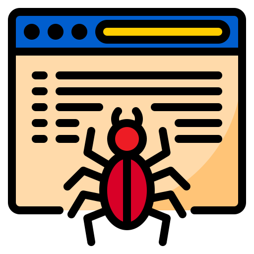

<!-- PROJECT LOGO -->
<br />
<div align="center">
  <a href="https://github.com/kiwiscode/go-react-crawler">

  </a>

  <h3 align="center">Go-React Web Crawler</h3>

  <p align="center">
    A fullstack web crawler built with Go (Gin), React, and MySQL
    <br />
    <br />
    <a href="https://go-react-crawler.vercel.app">View Demo</a>
    &middot;
    <a href="https://github.com/kiwiscode/go-react-crawler/issues/new?labels=bug&template=bug-report--.md">Report Bug</a>
    &middot;
    <a href="https://github.com/kiwiscode/go-react-crawler/issues/new?labels=enhancement&template=feature-request---.md">Request Feature</a>
  </p>
</div>

<!-- TABLE OF CONTENTS -->
<details>
  <summary>Table of Contents</summary>
  <ol>
    <li>
      <a href="#about-the-project">About The Project</a>
      <ul>
        <li><a href="#built-with">Built With</a></li>
      </ul>
    </li>
    <li>
      <a href="#getting-started">Getting Started</a>
      <ul>
        <li><a href="#installation">Installation</a></li>
      </ul>
    </li>
    <li><a href="#usage">Usage</a></li>
    <li><a href="#roadmap">Roadmap</a></li>
    <li><a href="#contributing">Contributing</a></li>
    <li><a href="#license">License</a></li>
    <li><a href="#contact">Contact</a></li>
  </ol>
</details>

<!-- ABOUT THE PROJECT -->

## About The Project

This full-stack project uses GoLang for the backend and React TypeScript for the frontend.

The UI is designed with shadcn/ui and TailwindCSS to create a fully responsive application. Users can input any URL they want to crawl, and the app returns the HTML content of that website. Additionally, the crawled URL’s output can be viewed in a table format, and detailed data can be explored through graphical visualizations on a separate details page.

<p align="right">(<a href="#readme-top">back to top</a>)</p>

### Built With

- [![React][React.js]][React-url]
- [![TypeScript][TypeScript]][TypeScript-url]
- [![GoLang][GoLang]][GoLang-url]
- [![GinGonic][GinGonic]][GinGonic-url]
- [![TailwindCSS][TailwindCSS]][TailwindCSS-url]
- [![Shadcn/ui][Shadcn/ui]][Shadcn/ui-url]

<p align="right">(<a href="#readme-top">back to top</a>)</p>

<!-- GETTING STARTED -->

## Getting Started

### Installation

1. Clone the repo
   ```sh
   git clone https://github.com/kiwiscode/go-react-crawler
   ```

_If you are going to run it with Docker in a development environment, follow the step below:_

2. Build and run with Docker Compose
   ```sh
   docker-compose up --build
   ```

_If you want to run it manually in a development environment, follow the steps below:_

2. Install Frontend Dependencies and Start Frontend (React)
   ```sh
   cd frontend
   npm install
   npm run dev
   ```
3. Install Backend Dependencies and Start Backend (Go)

   ```sh
   cd backend
   go mod tidy
   go run main.go

   ```

<p align="right">(<a href="#readme-top">back to top</a>)</p>

<!-- USAGE EXAMPLES -->

## Usage

The video below demonstrates how to use the app step-by-step. It’s designed to help you quickly understand the main features and workflow.

https://github.com/user-attachments/assets/2541db93-68c3-4a4e-9168-bd9cd85abe7d

<p align="right">(<a href="#readme-top">back to top</a>)</p>

<!-- ROADMAP -->

## Roadmap

- [x] Add authentication
- [x] Add URL process UI
- [x] Add start/stop analysis toggle for URL analysis
- [x] Make UI responsive
- [x] Add paginated and sortable table
- [x] Add global filter to the table
- [x] Add column filters to the table
- [x] Add checkbox selection for analyses in the table
- [x] Enable deleting or re-running selected analyses via checkboxes
- [x] Add row click redirect to URL detail page
- [x] Display URL details with charts on the URL detail page
- [x] Show crawl status per URL as queued, running, done, or error

See the [open issues](https://github.com/kiwiscode/go-react-crawler/issues) for a full list of proposed features (and known issues).

<p align="right">(<a href="#readme-top">back to top</a>)</p>

<!-- CONTRIBUTING -->

## Contributing

Contributions are what make the open source community such an amazing place to learn, inspire, and create. Any contributions you make are **greatly appreciated**.

If you have a suggestion that would make this better, please fork the repo and create a pull request. You can also simply open an issue with the tag "enhancement".
Don't forget to give the project a star! Thanks again!

1. Fork the Project
2. Create your Feature Branch (`git checkout -b feature/AmazingFeature`)
3. Commit your Changes (`git commit -m 'Add some AmazingFeature'`)
4. Push to the Branch (`git push origin feature/AmazingFeature`)
5. Open a Pull Request

<p align="right">(<a href="#readme-top">back to top</a>)</p>

## License

This project is licensed under the MIT License.
See the [LICENSE](https://github.com/kiwiscode/go-react-crawler/blob/main/LICENSE) file for details.

<p align="right">(<a href="#readme-top">back to top</a>)</p>

## Contact

Aykut Kav - [@kiwisc0de](https://twitter.com/kiwisc0de) - ayktkav@gmail.com

Project Link: [https://github.com/kiwiscode/go-react-crawler](https://github.com/kiwiscode/go-react-crawler)

<p align="right">(<a href="#readme-top">back to top</a>)</p>

[contributors-shield]: https://img.shields.io/github/contributors/othneildrew/Best-README-Template.svg?style=for-the-badge
[contributors-url]: https://github.com/othneildrew/Best-README-Template/graphs/contributors
[forks-shield]: https://img.shields.io/github/forks/othneildrew/Best-README-Template.svg?style=for-the-badge
[forks-url]: https://github.com/othneildrew/Best-README-Template/network/members
[stars-shield]: https://img.shields.io/github/stars/othneildrew/Best-README-Template.svg?style=for-the-badge
[stars-url]: https://github.com/othneildrew/Best-README-Template/stargazers
[issues-shield]: https://img.shields.io/github/issues/othneildrew/Best-README-Template.svg?style=for-the-badge
[issues-url]: https://github.com/othneildrew/Best-README-Template/issues
[license-shield]: https://img.shields.io/github/license/othneildrew/Best-README-Template.svg?style=for-the-badge
[license-url]: https://github.com/othneildrew/Best-README-Template/blob/master/LICENSE.txt
[linkedin-shield]: https://img.shields.io/badge/-LinkedIn-black.svg?style=for-the-badge&logo=linkedin&colorB=555
[linkedin-url]: https://linkedin.com/in/othneildrew
[product-screenshot]: images/screenshot.png
[TypeScript]: https://shields.io/badge/TypeScript-3178C6?logo=TypeScript&logoColor=FFF&style=flat-square
[TypeScript-url]: https://www.typescriptlang.org/
[React.js]: https://img.shields.io/badge/React-20232A?style=for-the-badge&logo=react&logoColor=61DAFB
[React-url]: https://reactjs.org/
[TailwindCSS]: https://img.shields.io/badge/Tailwind_CSS-grey?style=for-the-badge&logo=tailwind-css&logoColor=38B2AC
[TailwindCSS-url]: https://tailwindcss.com/
[Shadcn/ui]: https://img.shields.io/badge/shadcn%2Fui-000?logo=shadcnui&logoColor=fff&style=for-the-badge
[Shadcn/ui-url]: https://ui.shadcn.com/
[GoLang]: https://img.shields.io/badge/golang-00ADD8?&style=plastic&logo=go&logoColor=white
[GoLang-url]: https://go.dev/
[GinGonic]: https://img.shields.io/static/v1?label=Product&message=github.com%2Fgin-gonic%2Fgin&color=blue
[GinGonic-url]: https://go.dev/
